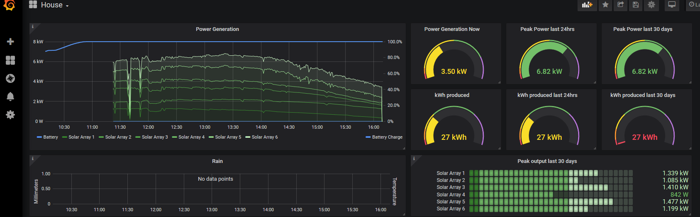

# Pika To MQTT

This handy little tool will allow you to scrape the Pika website (actually the same JSON they use) and publish it via MQTT protocol.

It was created since I didn't particularly care for their website and because I do this with all other data sources around my house, and it would thus allow me to coalesce data points to create new features (like, if we generate enough power and the temperature is too high, start the AC even if we're not home, etc).

## Usage

It's really simple, it requires the URL to your pika profile. Unfortunately, because I'm lazy, you will have to make your solar system public so no login is required to access the details. Once this has been done, you "simply" run `pika2mqtt.py` with the following parameters:

- url to your profile (for example, https://profiles.pika-energy.com/users/0123456789)
- MQTT broker (for example, mqtt.local)
- A base for all topics to be published, I use `house/energy`

A complete command line would look like this (using above information)

```
./pika2mqtt.py https://profiles.pika-energy.com/users/0123456789 mqtt.local house/energy
```

This will launch the tool and begin polling the JSON endpoint every minute (that's as often as they refresh the data, so don't bother hitting it harder).

It will also show a local output of what it is doing, which may look something like this

```
System status:
flags                           . watts    . serial       . Device and power
0x00000010 Disbled              |        0 | -my-serial- | Beacon [Beacon] | 0.0
0x00000820 Grid connected       |     4590 | -my-serial- | Islanding Inverter [Inverter] | 121.0
Publishing new output (4590) for house/energy/inverter_-my-serial-
0x00000300 Standby              |        0 | -my-serial- | B-Link Battery Converter [Battery] | 100.0
0x00002010 Making power         |      636 | -my-serial- | PV Link [Solar] | 130.0
Publishing new output (636) for house/energy/solar-my-serial-
0x00002010 Making power         |     1012 | -my-serial- | PV Link [Solar] | 130.0
Publishing new output (1012) for house/energy/solar_-my-serial-
0x00002010 Making power         |      629 | -my-serial- | PV Link [Solar] | 130.0
Publishing new output (629) for house/energy/solar_-my-serial-
0x00002010 Making power         |      307 | -my-serial- | PV Link [Solar] | 130.0
Publishing new output (307) for house/energy/solar_-my-serial-
0x00002010 Making power         |      816 | -my-serial- | PV Link [Solar] | 130.0
Publishing new output (816) for house/energy/solar_-my-serial-
0x00002010 Making power         |     1144 | -my-serial- | PV Link [Solar] | 130.0
Publishing new output (1144) for house/energy/solar_-my-serial-
```
It's not pretty but it tells you what it's doing at a glance. On first request of the JSON data, all topics will be published to make sure you have a baseline, after that, it will only publish changes to keep down the spam.

For all power generating/charging units, it will produce a topic ending with `output` for when it's producing power and `input` for when consuming. Typically only the battery will consume power (well, the inverter sometimes does it too if the sun is down and your system is grid tied).

All devices publish a `state` which is the raw state of the unit (see source for how to map that if you're interested). A bettery will also publish a `charge` topic, which indicates the charge of your battery. It's going to be a multiple of 10 since I want to avoid floats but still keep 1 fraction's precision (same as pika). So 945 is 94.5%

The topic also contains the device type and the serial number, so a solar panel with the id `00010003BEEF` will publish the following topics:

```
house/energy/solar_00010003BEEF/output
house/energy/solar_00010003BEEF/state
```

And a battery will look like this

```
house/energy/battery_00010003BEEF/input
house/energy/battery_00010003BEEF/output
house/energy/battery_00010003BEEF/state
house/energy/battery_00010003BEEF/charge
```

Now, when you combine this tool with [telegraf](https://www.influxdata.com/time-series-platform/telegraf/ "telegraf"), [influxDB](https://www.influxdata.com/products/influxdb-overview/ "influxDB") and [grafana](https://grafana.com/ "grafana"), you get nice looking items such as


